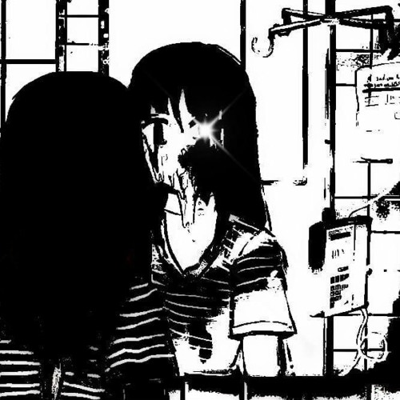

# synced nitro promotion link generator
## IT'S JOEVER...

the one and only tool for manipulating the whole server boosting/nitro token market  
that's why your 1m server boosts got revoked - because this gen got patched

my most advanced project for fighting with discord so far (wasted 2 weeks on this)   
it got patched though, because they added more packet validations  
i could have unpatched this, but i couldn't understand how packet header parsing works...

check [index.txt](index.txt) - maybe you can unpatch this (there is still some time left)

